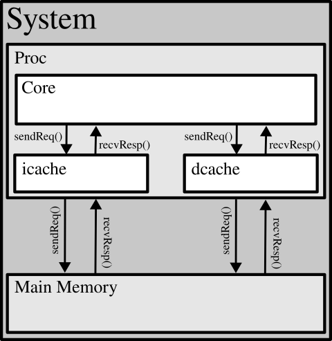

# pyArchSim
By\ Khalid Al-Hawaj

This is the repository for pyArchSim. In here, you should be able to get all Python code for the simulator alongside some examples.

pyArchSim is an educational-class approximate cycle-level simulator written fully in Python.

## 1. Getting Started

The simulator is placed in the top-level directory and named `pasim`. The simulator instantiate an assembler to assemble a source code (which is written in assembly language) into an `elf` file. The `elf` file contains all the binary described/encoded by the source code. The `elf` file is then loaded into the main memory of the system through the `loader`, as will be explained later.

To understand better about the simulator, you can pass the help argument as follows:

```
$ ./pasim -h
INFO: Set root_dir to "/work/kfupm/pyArchSim"
usage: pasim [-h] [-m MAX_NUM_CYCLES] [-l] [-f LINETRACE_FILE] asm_file

An Educational Architectural Simulator Written in Python

positional arguments:
  asm_file

options:
  -h, --help            show this help message and exit
  -m MAX_NUM_CYCLES, --max-num-cycles MAX_NUM_CYCLES
  -l, --linetrace
  -f LINETRACE_FILE, --linetrace-file LINETRACE_FILE

By Khalid Al-Hawaj
```

To try the simulator, you can try to run a simple `vvadd` example:

1. Create an example assembly source code file as follows:
```
$ cat > example.asm<<'EOL'
.data
  array0:   .word  0, 2, 4, 6, 8, 10, 12, 14, 16, 18
  array1:   .word  1, 3, 5, 7, 9, 11, 13, 15, 17, 19
  array2:   .space 40
  arrayLen: .word  10
.text
  # test
  la    $t7, arrayLen
  lw    $t0, 0($t7)
  la    $t1, array0
  la    $t2, array1
  la    $t3, array2

  addiu $v0, $0, 88 # ROI
  syscall

  beq   $t0, $zero, vvadd_done
vvadd:
  lw    $t4, 0($t1)
  lw    $t5, 0($t2)
  addu  $t4, $t4, $t5
  sw    $t4, 0($t3)
  addiu $t1, $t1, 4
  addiu $t2, $t2, 4
  addiu $t3, $t3, 4
  addiu $t0, $t0, -1
  bne   $t0, $zero, vvadd

vvadd_done:
  addiu $v0, $0, 88
  syscall

  addiu $v0, $0, 10
  syscall
EOL
```

2. Run the example assembly file as follows:

```
$ ./pasim example.asm
INFO: Set root_dir to ""

 + Overall Total Statistics:
     - Total Number of Cycles = 186
     - Total Number of Completed Instructions = 105
     - Average IPC = 0.56
     - Average CPI = 1.77

 + ROI Statistics:
     - ROI Number of Cycles = 157
     - ROI Number of Completed Instructions = 93
     - ROI Average IPC = 0.59
     - ROI Average CPI = 1.69
```

3. To see the linetrace, one can pass the argument `--linetrace`, as follows:

```
$ ./pasim example.asm --linetrace
INFO: Set root_dir to ""
+----------+------------+----------+----------+----------+----------+----------+-----+
| Cycle    | Fetch      | Decode   | Execute  | Memory   | Complete |          | Mem |
+----------+------------+----------+----------+----------+----------+----------+-----+
         0 | 0x04000000 |          |          |          |          | >>=||=>> | mem |
         1 | 0x04000004 | lui      |          |          |          | >>=||=>> | mem |
         2 | S <<<      | S raw    | lui      |          |          | >>=||=>> | mem |
         3 | 0x04000008 | ori      |          | lui      |          | >>=||=>> | mem |
         4 | S <<<      | S raw    | ori      |          | lui      | >>=||=>> | mem |
         5 | 0x0400000c | lw       |          | ori      |          | >>=||=>> | mem |
         6 | 0x04000010 | lui      | lw       |          | ori      | >>=||=>> | mem |
         7 | S <<<      | S raw    | lui      | lw       |          | >>=||=>> | mem |
         8 | 0x04000014 | ori      |          | lui      | lw       | >>=||=>> | mem |
         9 | 0x04000018 | lui      | ori      |          | lui      | >>=||=>> | mem |
        10 | S <<<      | S raw    | lui      | ori      |          | >>=||=>> | mem |
        11 | 0x0400001c | ori      |          | lui      | ori      | >>=||=>> | mem |
        12 | 0x04000020 | lui      | ori      |          | lui      | >>=||=>> | mem |
        13 | S <<<      | S raw    | lui      | ori      |          | >>=||=>> | mem |
        14 | 0x04000024 | ori      |          | lui      | ori      | >>=||=>> | mem |
        15 | 0x04000028 | addiu    | ori      |          | lui      | >>=||=>> | mem |
        16 | S <<<      | S |>>    | addiu    | ori      |          | >>=||=>> | mem |
        17 | S <<<      | S |>>    |          | addiu    | ori      | >>=||=>> | mem |
        18 | S <<<      | S |>>    |          |          | addiu    | >>=||=>> | mem |
        19 | 0x0400002c | syscall  |          |          |          | >>=||=>> | mem |
.
.
.
```

4. To save the linetrace to a different file, which can be inspected at some other time or for documentation purposes. One can set the `-f` argument as follows:

```
$ ./pasim example.asm --linetrace -f example.trace
INFO: Set root_dir to ""

 + Overall Total Statistics:
     - Total Number of Cycles = 186
     - Total Number of Completed Instructions = 105
     - Average IPC = 0.56
     - Average CPI = 1.77

 + ROI Statistics:
     - ROI Number of Cycles = 157
     - ROI Number of Completed Instructions = 93
     - ROI Average IPC = 0.59
     - ROI Average CPI = 1.69

$ head -n10 example.trace
+----------+------------+----------+----------+----------+----------+----------+-----+
| Cycle    | Fetch      | Decode   | Execute  | Memory   | Complete |          | Mem |
+----------+------------+----------+----------+----------+----------+----------+-----+
         0 | 0x04000000 |          |          |          |          | >>=||=>> | mem |
         1 | 0x04000004 | lui      |          |          |          | >>=||=>> | mem |
         2 | S <<<      | S raw    | lui      |          |          | >>=||=>> | mem |
         3 | 0x04000008 | ori      |          | lui      |          | >>=||=>> | mem |
         4 | S <<<      | S raw    | ori      |          | lui      | >>=||=>> | mem |
         5 | 0x0400000c | lw       |          | ori      |          | >>=||=>> | mem |
         6 | 0x04000010 | lui      | lw       |          | ori      | >>=||=>> | mem |
```

## 2. General Overview
The overall structure for pyArchSim is shown in the following figure:



The pyArchSim utilizes classes to represent each block in above figure. As long as the interfaces are maintained, each class can be independently changed to model any hardware. As a default, pyArchSim comes with default models for each component.

The default stracture of pyArchSim is as follows:

1. **System (Python package: `pyArchSimLib.system`):** the overall system representing a processor, main memory, and a kernel.
2. **Proc (Python package: `pyArchSimLib.proc`):** the processor model which includes the core and the uncore.
3. **Main Memory (Python package: `pyArchSimLib.mem.main`):** the main memory model.
4. **Core (Python package: `pyArchSimLib.core`):** the core part of the processor, which handles the execution.
5. **icache/dcache (Python package: `pyArchSimLib.mem.cache`):** model for caches to alleviate memory latency.

In the following subsections, the default model and the interfaces between the different classes are explained verbosely.

### 2.1. Common Interfaces

All components, regardless their purpose and model, must implement the following interfaces:

1. **`tick()`:** a function to indicate a new cycle. The components can execute all functionalities modeled to be in one cycle.
2. **`linetrace()`:** a function to return a string indicating what the component has performed. This should be made very succinct to be true to form--where the linetrace for the whole system has to fit within a line.

### 2.2. System

The system instantiates the processor, main memory, and the kernel. These subcomponents operate on the same level, where each subcomponent do not fully contain other subcomponents. The simulator interfaces with the system. The following interfaces must be implemented for the simulator to work correctly:

1. **`loader(elf)`**: Given an `elf` file with multiple different sections, the loader must load all the binary data contained in the `elf` file into the main memory.
2. **`getMem()`**: Returns the main memory object.
3. **`getExitStatus()`**: This function returns a tuple of a Boolean value and an exit status code. This function is invoked by the simulator every tick/cycle to indicate whether the simulation must be terminated and with what exit status code. The function is often a pass-through to the same interface funtion in the processor object.
4. **`roiFlag()`**: A function to return whether the tick/cycle is considered to be within a region-of-interest (ROI) segment of the execution. The function is often a pass-through to the same interface funtion in the processor object.
5. **`instCompletionFlag()`**: A function to return whether an instruction was completed/committed in a given cycle/tick. The function is often a pass-through to the same interface funtion in the processor object.

The default class included in pyArchSim is "`pyArchSimLib.systen.BasicSystem`". The default class instantiates two default classes for the process and main memory: "`pyArchSimLib.proc.FiveStageInorderProcessor`" and "`pyArch.mem.main.SimpleMultiportedMemory`", respectively.

#### 2.2.1 Processor

The processor instantiates the core and uncore. The core handles the execution of the instructions. Most of the interfaces from the system object are forwarded to the processor, which in-turn forwards them to the core. The uncore contains the caches. In actuality, level-1 caches are part of the core, since the timing is often tightly coupled with the pipeline. However, from a modeling perspective, there is no harm in separating level-1 caches and the core. The process must implement the following interfaces:

1. **`getExitStatus()`**: This function returns a tuple of a Boolean value and an exit status code. This function is invoked by the simulator every tick/cycle to indicate whether the simulation must be terminated and with what exit status code. The function is often a pass-through to the same interface funtion in the core object.
2. **`roiFlag()`**: A function to return whether the tick/cycle is considered to be within a region-of-interest (ROI) segment of the execution. The function is often a pass-through to the same interface funtion in the core object.
3. **`instCompletionFlag()`**: A function to return whether an instruction was completed/committed in a given cycle/tick. The function is often a pass-through to the same interface funtion in the core object.

In addition to these interface functions, the processor is the first component that introduces interfacing functions to enable connecting components together. One part of the connections are used for cycle-level simulations, while the other part is used to handle syscall emulation.

Interfacing functions used to model cycle-level simulation:

1. **`setMemCanReq(MemCanReq)`**: A function "`canReq()`" to be invoked by the requesting component to the memory. The function returns a boolean value representing whether the interface is able to accomodate a request or it is saturated. This is part of a function-based modeling for a valid-ready interface.
2. **`setMemSendReq(MemSendReq)`**: A function "`sendReq()`" to be invoked by the requesting component to the memory. The function sends a request (i.e., either a read or write request) to the memory. The memory might assert that "`canReq()`" is true.
3. **`setMemHasResp(MemHasResp)`**: A function "`hasResp()`" to be invoked by the requesting component to the memory. The function returns a boolean value representing whether the interface has a valid response for a previously sent request. This is part of a function-based modeling for a valid-ready interface.
4. **`setMemRecvResp(MemRecvResp)`**: A function "`recvResp()`" to be invoked by the requesting component to the memory. The function returns a response for a previously sent request (i.e., either a read or write response) from the memory. The memory might assert that "`hasResp()`" is true.

Interfacing functions used to handle syscall emulation:

1. **`setMemReadFunct(MemReadFunct)`**: A function that enables syscall emulation code to read from the memory without adhering to the cycle-level approximate model.
2. **`setMemWriteFunct(MemWriteFunct)`**: A function that enables syscall emulation code to write to the memory without adhering to the cycle-level approximate model.

The default class for the processor in pyArchSim is "`pyArchSimLib.proc.FiveStageInorderProcessor`". The default processor insantiates the following for the subcomponents: "`pyArchSimLib.proc.core.FiveStageInorderCore`" for the core, and two caches of class "`pyArchSimLib.mem.cache.NoCache`". The two caches are: the icache, which is used for the instruction port; and the dacache, which is used for the data port.

#### 2.2.1.1 Core

The core handles the execution of all instructions. By the time the core is tick'd, the main memory has already been initialized and loaded with the `elf` file. For the default pyArchSim, the core is instantiated as an object of the "`pyArchSimLib.proc.core.FiveStageInorderCore`" class. Currently, the syscalls are executed magically (i.e., syscall emulation). However, in future updates, it is planned for the syscall to be handled by a kernel. A core class must implement the following interfacing functions:

1. **`getExitStatus()`**: A function to return a tuple of the exit status and a return code. These values are set through syscals.
2. **`roiFlag()`**: A function to return a boolean value representing whether the ROI flag has been set or not. The ROI flag represent whether an ROI region is being executed, which impacts statistics reporting for cycle count and instruction count. This flag is set through a syscall, currently.
3. **`instCompletionFlag()`**: A function to return a boolean value representing whether an instruction is being committed/completed in a given tick/cycle. For a simple five-stage core, this flag is set in every tick/cycle where the writeback stage is busy with a valid dynamic instruction and it is unblocked.

To support syscall emulation, the following interfacing functions must be supported by a core class to establish proper connections:

1. **`setMemReadFunct(MemReadFunct)`**: Set a pointer to a function to perform reads from the memory without confirming to the cycle-level approximate model.
2. **`setMemWriteFunct(MemWriteFunct)`**: Set a pointer to a function to perform writes to the memory without confirming to the cycle-level approximate model.

The core implements a Harvard architecture, where the instruction memory port is separated from the data memory port. To connect the core to the uncore, the following interfacing functions must be supported by the core class to establish proper connections:

1. **`setIMemCanReq(iMemCanReq)`**/**`setDMemCanReq(dMemCanReq)`**: Set a pointer function to the "`canReq()`" function, as discussed before. There are two pointers, one to each port required for the core.
2. **`setIMemSendReq(iMemSendReq)`**/**`setDMemSendReq(dMemSendReq)`**: Set a pointer function to the "`sendReq()`" function, which sent a request to the memory to perform either a read or a write. There are two pointers, one to each port required for the core.
3. **`setIMemHasResp(iMemHasResp)`**/**`setDMemHasResp(dMemHasResp)`**: Set a pointer function to the "`hasResp()`" function, as discussed before. There are two pointers, one to each port required for the core.
4. **`setIMemRecvResp(iMemRecvResp)`**/**`setDMemRecvResp(dMemRecvResp)`**: Set a pointer function to the "`recvResp()`" function, which recieves a response from the memory for a previously sent request. There are two pointers, one to each port required for the core.

The default core "`pyArchSimLib.proc.core.FiveStageInorderCore`" is modeled through a five simple functions: `f()`, `d()`, `x()`, `m()`, and `w()`. Each function represents one of the five-stages: fetch, decode, execute, memory, and writeback. To model a pipeline, there are pipeline registers that are between the modeled stages: `f2d`, `d2x`, `x2m`, and `m2w`. Also, a tick simply calls these functions in reverse order, as such:

```
def tick(s):
  # Tick backwards
  s.w()
  s.m()
  s.x()
  s.d()
  s.f()
```
Each invocation processes an input to the stage and outputs the result in the pipeline registers between the current stage and the subsequent stage.

#### 2.2.1.2 icache/dcache

Any cache class must implement an interface similar to a memory, as it looks like a memory to any other connected component; the cache class must also connect to the main memory (or another cache) to handle a cache miss. Enforcing the same interface as the main memory makes it easy to connect any cache hierarchy without any changes to the core. As a result, the cache class implements all functions required for a memory class, alongside all interfacing functions required to connect an object to a memory. The following functions are required to establish an interface for a memory-like component:

1. **`canReq()`**: A function to return whether the cache can accept an incoming memory request for either a read or a write.
2. **`sendReq(req)`**: A function to receive a memory request from a requester.
3. **`hasResp()`**: A function to return whether the cache has a response for a previously sent memory request.
4. **`recvResp()`**: A function to return the ready and available memory response to the requester.

In case of a cache miss, the cache must make a memory request to either another level of caching, or to the main memory. The following interfacing functions are required by a cache class to enable connecting the cache to the main memory or another cache:

1. **`setMemCanReq(MemCanReq)`**: Set a pointer to a function for "`canReq()`". This function can either be provided by a memory or another cache object.
2. **`setMemSendReq(MemSendReq)`**: Set a pointer to a function for "`sendReq()`". This function can either be provided by a memory or another cache object.
3. **`setMemHasResp(MemHasResp)`**: Set a pointer to a function for "`hasResp()`". This function can either be provided by a memory or another cache object.
4. **`setMemRecvResp(MemRecvResp)`**: Set a pointer to a function for "`recvResp()`". This function can either be provided by a memory or another cache object.

The default class for pyArchSim is "`pyArchSimLib.mem.cache.NoCache`". The default cache class acts as a pass-through where the incoming requests and outgoing response are forwarded to or from lower-level of caches or the main memory.

#### 2.2.2 Main Memory

The main memory receives read or write requests and process them according to the hardware modeled. Then, the interface is leveraged to implement a valid-ready protocol through function calls. The following interfacing functions must be implemented:

1. **`canReq(port_id)`**: A function to return whether the main memory can accept an incoming memory request for either a read or a write.
2. **`sendReq(port_id, req)`**: A function to receive a memory request from a requester.
3. **`hasResp(port_id)`**: A function to return whether the main memory has a response for a previously sent memory request.
4. **`recvResp(port_id)`**: A function to return the ready and available memory response to the requester.

To support multi-ported main memory, a `port_id` is passed as an argument. In future versions, a etter method to model multiple ports should be developed.

A memory request "`req`" is a simple Python dictionary with the following fields:

1. `req['op']`: Requested operation. A value of 0 for read, and 1 for write.
2. `req['data']`: A simple list of bytes for the attached data, in case of a write.
3. `req['addr']`: Byte-addressable address for the request.
4. `req['size']`: Size of the memory request in bytes.
5. `req['mask']`: A mask, which is a bit vector, indicating which bytes are included and which bytes are skipped.
6. `req['tag']`: A 32-bit arbitrary tag used for the requester to identify the request/response pairing.

A memory response "`resp`" is a simple Python dictionary with the following fields:

1. `resp['op']`: The memory operation for the request, to which the response is generated.
2. `resp['addr']`: The byte-addressable memory address for the request, to which the response is generated.
3. `resp['data']`: A simple list of bytes for the response, in case of a read.
4. `resp['size']`: Size of the memory request in bytes.
5. `resp['mask']`: A mask, which is a bit vector, indicating which bytes are included and which bytes are skipped.
6. `resp['tag' ]`: A 32-bit arbitrary tag used for the requester to identify the request/response pairing. This is a copy of the tag from the memory request, to which this is the response.

The default class in pyArchSim for the main memory is "`pyArchSimLib.mem.main.SimpleMultiportedMemory`". The default class models a multi-ported main memory with constant delay for each request. The main memory is not pipelined, which means it has single occupancy for the requests per port. The default instantiation is for dual-ported main memory. There is no guarantee on forwarding data between the ports in-case of an aliased write and read within the same cycle.
